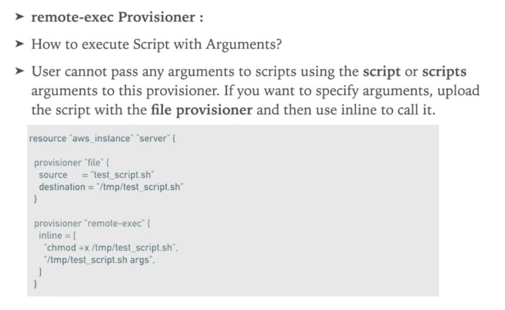

# HashiCorp Terraform 2021: Hands-On & Terraform Labs

---

- IaC (Infrastructure as Code) is the process of managing and provisioning computer data centers, manage your IT infrastructure using configuration files
- IaC Benefits - Speed, Consistency
- local-exec provisioner is used to run CLI for your target system in order to create, update or interact with remote objects in that system
- remote-exec provisioner invokes a script on a remote resource after it is created 

```shell
ssh -i {{pem}} ubuntu@{{PUBLIC_IP}}
```

```terraform
provider "aws" {
  access_key = ${var.AWS_ACCESS_KEY}
  secret_key = ${var.AWS_SECRET_KEY}
  region = ${var.AWS_REGION}
}
```

- Variables file extension vars.tf variables.tfvars
- `*`.tfvars must be configured in runtime

```terraform
AWS_ACCESS_KEY=""
AWS_SECRET_KEY=""
AWS_REGION=""
```

```bash
terraform plan -var AWS_ACCESS_KEY="{{ACCESS_KEY_HERE}}" -var AWS_SECRET_KEY="{{SECRET_KEY_HERE}}"
```

- Packer ia tool to Bundle the Custom AMIs

## VPC

> Virtual Private Cloud (VPC) - A virtual network dedicated to your AWS Account
> Subnet - A range of IP addresses in your VPC
> Route Table - A set of rules, called routes, that are used to determine where network traffic is directed
> Internet Gateway - A gateway that you attach to your VPC to enable communication between resources in your VPC ant the internet
> VPC Endpoint - Enables you to privately connect your VPC to supported AWS services and VPC endpoint services and VPC services powered by PrivateLink without requiring a Internet Gateway, NAT device, VPN Connection or AWS Direct Connection connection
> For small or Medium Setup One VPC will be enough
> VPC instances can **NEVER** communicate to other instances in another VPC by Private IP, public ip is a must to setup a communication inter VPC
> VPC Peering - communication using direct connection

## EBS Elastic Block storage

> EBS is a durable, block level storage device that you can attach to your instances
> EBS is like a secondary disk instance
> Can be increase the size with IOPS capacity provisioned by (SSD|HDD)

## EBS Attached in EC2 commands

- To Mount Volume

```bash
sudo -s
root@ip-1:~# df -h
root@ip-1:~# mkfs.ext4 /dev/xvdh
root@ip-1:~# mkdir -p /data
root@ip-1:~# mount /dev/xvdh /data
```

## Modules

- [Registry Terraform](https://registry.terraform.io)

## Conditions

- Equality == !=
- Numeric Comparison >,<, >=, <=
- &&, ||, !

## Terraform Production Projects

- Good Project structure is must have
- Code Modules are necessary in Production Projects
- Ideally there should be separate env for dev/hml/prod

## Packer

- Is Open source tool for creating **identical machine images** for multiple platforms
- Packer combines Pref Configured Image + Configurations and OS with packages which needs to be installer

## AWS EKS

- EKS by AWS CLI

- **curl -o aws-auth-cm.yaml**

```yaml
apiVersion: v1
kind: ConfigMap
metadata:
  name: aws-auth
  namespace: kube-system
data:
  mapRoles:
    - rolearn: <ARN of instance role>
    username: system:node:{{EC2PrivateDSNName}}
    groups:
      - system:bootstrappers
      - system:nodes
```

- Pre-requisites
  > AWSCLI
  > Install kubectl
  > Install aws-iam-authenticator
  > Create Role (for accessing EKS cluster create a role with AmazonEKSClusterPolicy and AmazonEKSServicePolicy policies)
  > Create VPC

```shell
aws --version
curl "https://awscli.amazonaws.com/awscli-exe-linux-x86_64.zip" -o "awscliv2.zip"
unzip awscliv2.zip
sudo ./aws/install
aws --version
```

- Further commands see section 12 - Lecture 79
